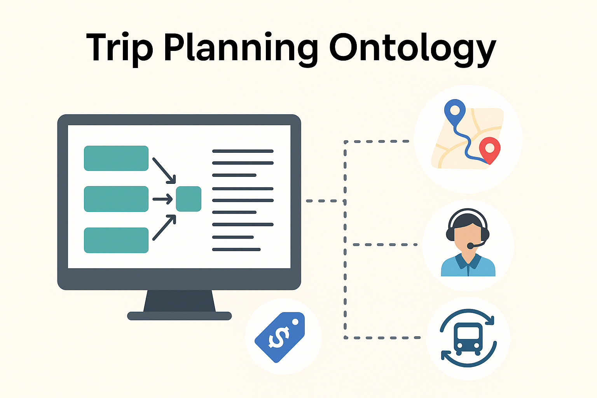

# Trip Planning Ontology Project



## Overview

This repository contains a comprehensive semantic web ontology for modeling trip planning services, enabling intelligent travel applications to reason about transportation options, connections, pricing, and weather conditions.

The ontology provides a formal vocabulary for describing:
- Complete travel itineraries with multiple segments
- Transportation modes, lines, and connections
- Pricing models and availability
- Weather conditions affecting travel
- Accommodation options

## 📚 Documentation

### [View Full Ontology Documentation](http://150.146.207.114/lode/extract?url=https%3A%2F%2Fgist.githubusercontent.com%2Fhoussamallali%2Fcf7ed8508c767c8b0e1fa82209446974%2Fraw%2F48f3b4171e4493896fada1d3a61ce44b9c3e17cb%2Fgistfile1.txt&owlapi=true&imported=true&closure=true&reasoner=true&lang=en)

[](http://150.146.207.114/lode/extract?url=https%3A%2F%2Fgist.githubusercontent.com%2Fhoussamallali%2Fcf7ed8508c767c8b0e1fa82209446974%2Fraw%2F48f3b4171e4493896fada1d3a61ce44b9c3e17cb%2Fgistfile1.txt&owlapi=true&imported=true&closure=true&reasoner=true&lang=en)

The Trip Planning Ontology is fully documented using LODE (Live OWL Documentation Environment), providing:

- Complete class hierarchy with descriptions
- Object and data properties with domains and ranges
- Visualization of relationships between concepts
- Examples of named individuals

**How to access the documentation:**
1. Click the blue badge above or the "View Full Ontology Documentation" link
2. The documentation will open in LODE's web interface
3. Navigate through sections using the table of contents on the left
4. Each ontology element is hyperlinked for easy navigation

Additionally, you can find basic HTML documentation in the `documentation/` folder of this repository.

## 📂 Repository Structure

```
TripPlanningProject/
├── ontology/
│   └── ontology.rdf       # Core ontology definition (RDF/XML)
├── instances/
│   └── trip_instances.ttl # Sample instances (Turtle format)
├── documentation/
│   └── index.html         # HTML documentation
└── README.md              # This file
```

## 🔍 Key Ontology Components

### Core Classes
- **TripPlan**: Complete travel plans with origin, destination and dates
- **TripSegment**: Individual portions of a journey (e.g., single train ride)
- **Itinerary**: Structured travel plans including multiple segments
- **TransportationMode**: Different modes of transport (train, bus, airplane)
- **Connection**: Transfers between different transportation modes
- **PricingModel**: Different pricing approaches (fixed, dynamic)
- **Weather**: Weather conditions affecting trips
- **Accommodation**: Lodging options during trips

### Class Hierarchy Visualization

```
TripPlan
  └── RoundTripPlan
TripSegment
  ├── OneWayTrip
  └── InternationalTrip
PricingModel
  ├── FixedPricingModel
  └── DynamicPricingModel
Weather
  ├── Sunny
  ├── Rainy
  └── Snowy
Accommodation
  ├── Hotel
  ├── Hostel
  └── VacationRental
```

### Key Relationships Diagram

```
TripPlan ─────hasItinerary────> Itinerary
     │
     └──departureInput/arrivalInput──> String
     
TripSegment ───hasMode────> TransportationMode
     │
     ├───hasWeather────> Weather
     │
     ├───hasPricingModel────> PricingModel
     │
     └───usesTransportationLine────> TransportationLine ───hasStop────> Stop
```

## 📋 Example Use Case

The ontology models a round trip between Paris and Berlin:

1. Paris to Cologne (TGV, 200 minutes, fixed pricing)
2. Connection in Cologne (20 minute transfer)
3. Cologne to Berlin (ICE, 240 minutes, dynamic pricing)
4. Return trip from Berlin to Paris (TGV, 360 minutes, dynamic pricing)

This demonstrates how complex multi-leg journeys can be modeled with different pricing models, international segments, and connections.

## 💻 Usage

### Opening the Ontology
- Open `ontology.rdf` in [Protégé](https://protege.stanford.edu/) (5.5.0 or higher recommended)
- Navigate class hierarchy to explore relationships
- View instances in the Individuals tab

### Sample SPARQL Queries

Find all international trips:
```sparql
SELECT ?trip ?origin ?destination
WHERE {
  ?trip a :TripSegment ;
        :isInternational "true"^^xsd:boolean ;
        :hasStop ?origin, ?destination .
  FILTER(?origin != ?destination)
}
```

### SPARQL Query Examples

Below are several practical SPARQL queries demonstrating how to extract useful information from the ontology:

#### 1. Find affordable trips with available seats

```sparql
SELECT ?trip ?origin ?destination ?price ?currency ?seats
WHERE {
  ?trip a :TripSegment ;
        :hasStop ?origin, ?destination ;
        :price ?price ;
        :priceCurrency ?currency ;
        :remainingSeats ?seats .
  FILTER(?origin != ?destination)
  FILTER(?price < 80.00 && ?seats > 10)
}
ORDER BY ?price
```

#### 2. Calculate total journey time for a multi-segment trip plan

```sparql
SELECT ?plan (SUM(?duration) AS ?totalMinutes) 
       (FLOOR(?totalMinutes/60) AS ?hours) (?totalMinutes - (?hours * 60) AS ?minutes)
WHERE {
  ?plan a :TripPlan ;
        :hasItinerary ?segment .
  ?segment :duration ?duration .
}
GROUP BY ?plan
```

#### 3. Find trips with short connections (potential tight transfers)

```sparql
SELECT ?trip ?connection ?transferTime
WHERE {
  ?trip a :TripSegment ;
        :hasConnection ?connection .
  ?connection :transferTime ?transferTime .
  FILTER(?transferTime < 30)
}
ORDER BY ?transferTime
```

#### 4. Compare pricing models across different transportation lines

```sparql
SELECT ?line ?pricingType (COUNT(?segment) as ?tripCount) (AVG(?price) as ?avgPrice)
WHERE {
  ?segment a :TripSegment ;
           :usesTransportationLine ?line ;
           :hasPricingModel ?pricingModel ;
           :price ?price .
  ?pricingModel a ?pricingType .
  FILTER(?pricingType IN (:FixedPricingModel, :DynamicPricingModel))
}
GROUP BY ?line ?pricingType
ORDER BY ?line
```

#### 5. Find round trip plans with return trips within a specific date range

```sparql
SELECT ?plan ?outboundSegment ?returnSegment ?returnDate
WHERE {
  ?plan a :RoundTripPlan ;
        :hasItinerary ?outboundSegment ;
        :hasReturnTrip ?returnSegment ;
        :returnDateInput ?returnDate .
  FILTER(?returnDate >= "2024-07-01T00:00:00"^^xsd:dateTime && 
         ?returnDate <= "2024-07-31T23:59:59"^^xsd:dateTime)
}
```

#### 6. Find all stops serviced by high-speed train lines

```sparql
SELECT DISTINCT ?stop ?stopLabel
WHERE {
  ?line a :TransportationLine ;
        rdfs:label ?lineLabel ;
        :hasStop ?stop .
  ?stop rdfs:label ?stopLabel .
  FILTER(CONTAINS(LCASE(?lineLabel), "tgv") || CONTAINS(LCASE(?lineLabel), "ice"))
}
ORDER BY ?stopLabel
```

#### 7. Complex query combining multiple conditions for trip planning

```sparql
SELECT ?origin ?destination ?duration ?price ?line ?seats
WHERE {
  ?trip a :TripSegment ;
        :hasStop ?origin, ?destination ;
        :duration ?duration ;
        :price ?price ;
        :usesTransportationLine ?line ;
        :remainingSeats ?seats ;
        :isInternational "true"^^xsd:boolean .
  ?origin rdfs:label ?originLabel .
  ?destination rdfs:label ?destinationLabel .
  ?line rdfs:label ?lineLabel .
  
  # Parameters that could be adjusted based on user preferences
  FILTER(?duration <= 360)              # Max 6 hours
  FILTER(?price <= 100.00)              # Max €100
  FILTER(?seats >= 5)                   # Need at least 5 seats
  FILTER(?origin != ?destination)
  
  # Looking for trips involving Paris
  FILTER(CONTAINS(LCASE(?originLabel), "paris") || CONTAINS(LCASE(?destinationLabel), "paris"))
}
ORDER BY ?duration ?price
```

These queries demonstrate how the Trip Planning Ontology can be used in practical applications to find, filter, and analyze trip data based on various criteria.

## 📊 Visualization Tools

The ontology can be visualized using:
- [WebVOWL](http://vowl.visualdataweb.org/webvowl.html) - Interactive web-based visualization
- [LODE](https://essepuntato.it/lode/) - Live OWL Documentation Environment
- Protégé OWLViz or OntoGraf plugins

Full LODE documentation is available [here](http://150.146.207.114/lode/extract?url=https%3A%2F%2Fgist.githubusercontent.com%2Fhoussamallali%2Fcf7ed8508c767c8b0e1fa82209446974%2Fraw%2F48f3b4171e4493896fada1d3a61ce44b9c3e17cb%2Fgistfile1.txt&owlapi=true&imported=true&closure=true&reasoner=true&lang=en).

## 👤 Author
- Houssam Allali, Oussama Guelfaa, Hamza Dadda, Noa Akayad

## 📄 License
This project is available under the MIT license. 